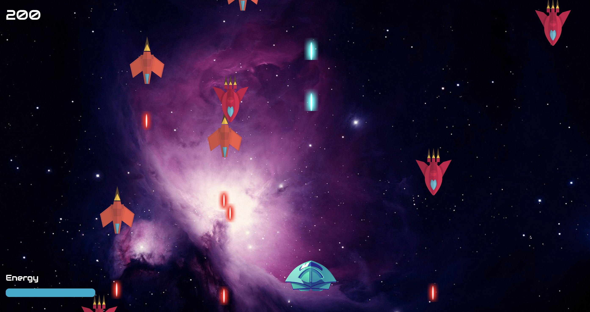

# Space Shooter

## Summary
This Space Shooter game is a rendition of the classic space shooter arcade games. I developed this game as a project that is part of the Ironhack Fullstack developer course in 2024.

## How to play

- Use the arrow keys to move.
- Hit the space bar to fire.

The goal of the game is to destroy as many enemy ships as possible.
Avoid collisions with enemies and laser beams. Collisions will
have a bigger impact on your ships energy level as being hit
by laser beams.

## Installation
To run this application, download the GitHub zip file or clone the repository. Then open the index.html file to start the game.

You can also play the game by clicking this link: 
https://krilleyeah.github.io/SpaceShooter/

## Developed using
- Object-Oriented JavaScript
- HTML
- CSS

## Licenses and ressources
Graphics by
[Designed by vectorpouch / Freepik](http://www.freepik.com)

